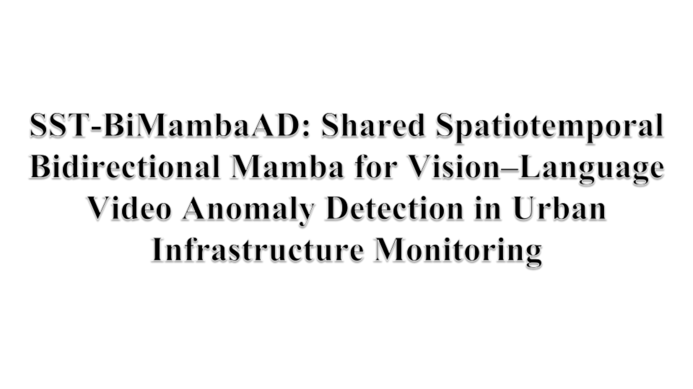
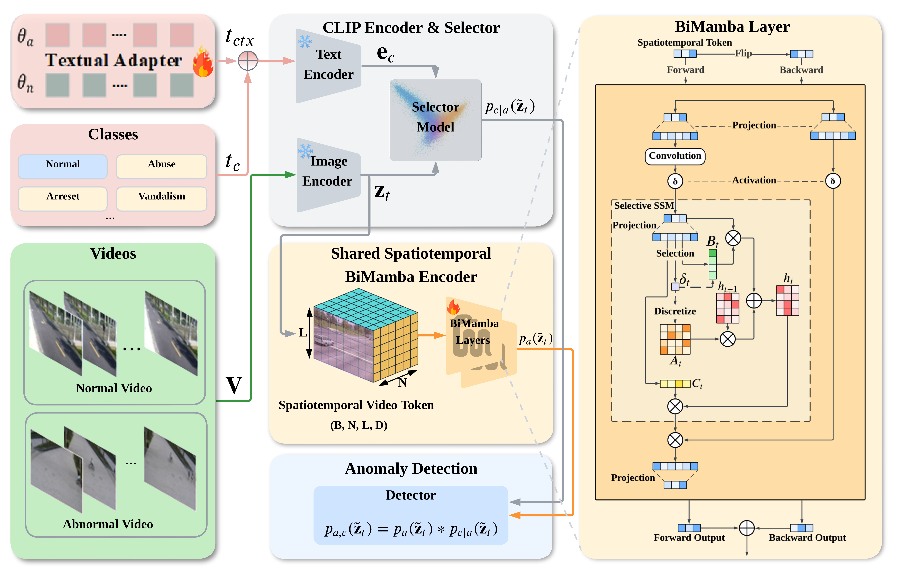

# AnomalyMamba

The source codes of "**SST-BiMambaAD: Shared Spatiotemporal Bidirectional Mamba for Vision–Language Video Anomaly Detection in Urban Infrastructure Monitoring**".

To cite this work:

```
@article{WANG2026104230,
title = {Vision–Language Foundation Models with State-Space Temporal Reasoning for Urban Infrastructure Anomaly Detection},
journal = {Computer-Aided Civil and Infrastructure Engineering},
volume = {70},
pages = {104230},
year = {2026},
issn = {1474-0346},
author = {Xiaowen Tao,Qingyuan Li,Bing Zhu,Yinuo Wang,Jiayi Han,Peixing Zhang,Pengxiang Meng},
keywords = {Video Anomaly Detection,Anomaly Recognition,Vision–Language Model,State Space Model,Weakly Supervised Learning,Urban Surveillance}
}
```

# Supplements

- Video that shows the SST-BiMambaAD performance on Handling the same exceptional scenario is more efficient.

  **Click to view the video:**

  <a href="https://www.youtube.com/watch?v=HKlqMVx5CBg" target="_blank">
  
  </a>

# Architecture

  
